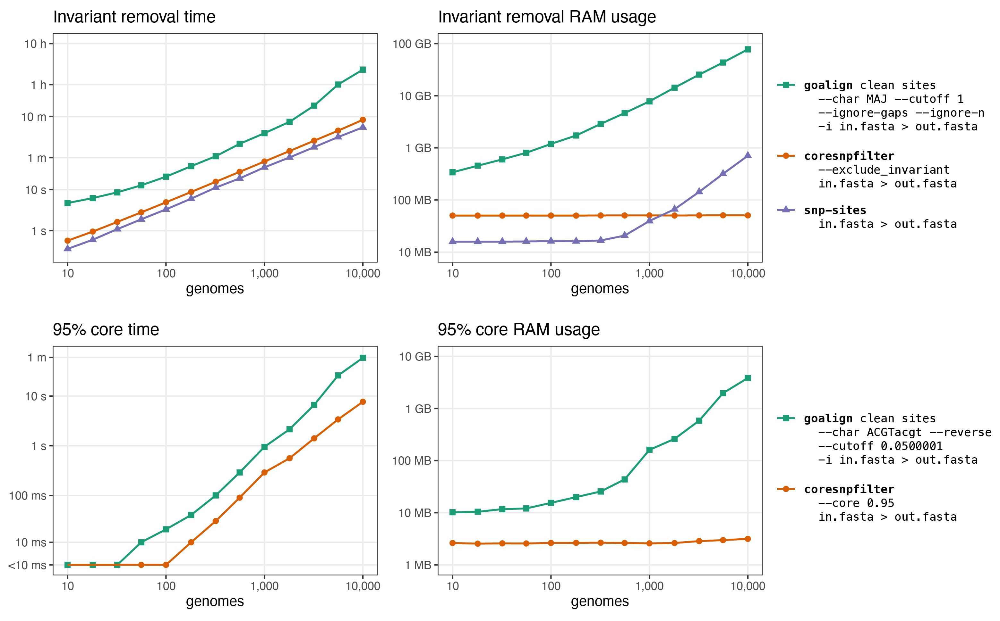

## Tasks and tools

This benchmarking test quantifies the time and RAM for these two tasks:
1. full alignment → no-invariant-sites alignment
2. no-invariant-sites alignment → 95% core alignment

[Core-SNP-Filter](https://github.com/rrwick/Core-SNP-filter) and [goalign](https://github.com/evolbioinfo/goalign) can do both #1 and #2, and [snp-sites](https://github.com/sanger-pathogens/snp-sites) can do #1.

All three tools were written in a fast compiled programming language: `coresnpfilter` in Rust, `goalign` in Go and `snp-sites` in C. `coresnpfilter` and `snp-sites` are single-threaded, and `goalign` is effectively single-threaded (while it has a `--threads` option, using multiple threads had no effect on performance, see below).

For each tool, I cloned the latest version from GitHub and built it from source on the same computer I used to run the tests (AMD EPYC 7742 CPU, 512 GB RAM).


## Commands

There was a lot of helpful discussion on [this thread](https://github.com/evolbioinfo/goalign/issues/5) regarding how to construct goalign commands.

These three commands produce the same output for task #1:
```bash
coresnpfilter --exclude_invariant "$input" > "$output"

snp-sites "$input" > "$output"

goalign clean sites --char MAJ --cutoff 1 --ignore-gaps --ignore-n -i "$input" > "$output"
```

The only differences seems to be:
* `coresnpfilter` and `goalign` preserve case (uppercase vs lowercase bases) while `snp-sites` does not.
* `goalign` includes line breaks in its output FASTA sequences while `coresnpfilter` and `snp-sites` do not.

These two commands produce the same output for task #2:
```bash
coresnpfilter --core 0.95 "$input" > "$output"

goalign clean sites --char ACGTacgt --reverse --cutoff 0.0500001 -i "$input" > "$output"
```

When using `--core 0.95`, Core-SNP-Filter will keep a site that is in exactly 95% of the sequences (e.g. 19/20). However, goalign will drop a site that is in exactly 95% of the sequences if it is run with `--cutoff 0.05`. To ensure that the tools produced the same result, I used `--cutoff 0.0500001` instead.


## Test data

I started with the same 10k genome Typhi pseudoalignment used in the paper, which I named `full_10000.fasta`. This alignment is 4,809,037 bp long (the length of the [_S. enterica_ CT18](https://www.ncbi.nlm.nih.gov/assembly/GCF_000195995.1) chromosome) and has a file size of 47 GB.

The sequences in this pseudoalignment contain only the following characters: `-`, `A`, `C`, `G`, `N`, `T`, `a`, `c`, `g`, `n`, `t`. I.e. the four bases (either uppercase or lowercase), N for unknown bases (either uppercase or lowercase) and dash for gaps.

I tested genome counts ranging from 10 to 10k, evenly spaced on a log scale.


# Benchmarking loop

Here is the full Bash code for creating the benchmarking results:
```bash
printf "test\tgenome_count\treplicate\ttool\tseconds\tram_kb\tinput_length\toutput_length\toutput_md5sum\n" > results.tsv

full_len=$(seqtk seq full_10000.fasta | head -n2 | tail -n1 | awk '{print length($0)}')

for rep in 1 2 3 4 5 6 7 8; do
    for count in 10 18 32 56 100 180 320 560 1000 1800 3200 5600 10000; do

        head -n$(($count * 2)) full_10000.fasta > subsample.fasta

        /usr/bin/time -f "%e\t%M" -o time.txt coresnpfilter --exclude_invariant subsample.fasta > result.fasta
        len=$(seqtk seq result.fasta | head -n2 | tail -n1 | awk '{print length($0)}')
        md5=$(seqtk seq -U result.fasta | md5sum | cut -f1 -d' ')
        printf "invariant site removal\t$count\t$rep\tCore-SNP-Filter\t%s\t$full_len\t$len\t$md5\n" "$(cat time.txt)" >> results.tsv
        mv result.fasta subsample_no_invariant.fasta
        no_invariant_len="$len"
        rm time.txt

        /usr/bin/time -f "%e\t%M" -o time.txt snp-sites subsample.fasta > result.fasta
        len=$(seqtk seq result.fasta | head -n2 | tail -n1 | awk '{print length($0)}')
        md5=$(seqtk seq -U result.fasta | md5sum | cut -f1 -d' ')
        printf "invariant site removal\t$count\t$rep\tsnp-sites\t%s\t$full_len\t$len\t$md5\n" "$(cat time.txt)" >> results.tsv
        rm result.fasta time.txt

        /usr/bin/time -f "%e\t%M" -o time.txt goalign clean sites -t 1 --char MAJ --cutoff 1 --ignore-gaps --ignore-n -i subsample.fasta > result.fasta
        len=$(seqtk seq result.fasta | head -n2 | tail -n1 | awk '{print length($0)}')
        md5=$(seqtk seq -U result.fasta | md5sum | cut -f1 -d' ')
        printf "invariant site removal\t$count\t$rep\tgoalign 1 thread\t%s\t$full_len\t$len\t$md5\n" "$(cat time.txt)" >> results.tsv
        rm result.fasta time.txt

        # /usr/bin/time -f "%e\t%M" -o time.txt goalign clean sites -t 16 --char MAJ --cutoff 1 --ignore-gaps --ignore-n -i subsample.fasta > result.fasta
        # len=$(seqtk seq result.fasta | head -n2 | tail -n1 | awk '{print length($0)}')
        # md5=$(seqtk seq -U result.fasta | md5sum | cut -f1 -d' ')
        # printf "invariant site removal\t$count\t$rep\tgoalign 16 threads\t%s\t$full_len\t$len\t$md5\n" "$(cat time.txt)" >> results.tsv
        # rm result.fasta time.txt

        rm subsample.fasta

        /usr/bin/time -f "%e\t%M" -o time.txt coresnpfilter --core 0.95 subsample_no_invariant.fasta > result.fasta
        len=$(seqtk seq result.fasta | head -n2 | tail -n1 | awk '{print length($0)}')
        md5=$(seqtk seq -U result.fasta | md5sum | cut -f1 -d' ')
        printf "95 core\t$count\t$rep\tCore-SNP-Filter\t%s\t$no_invariant_len\t$len\t$md5\n" "$(cat time.txt)" >> results.tsv
        rm result.fasta time.txt

        /usr/bin/time -f "%e\t%M" -o time.txt goalign clean sites -t 1 --char ACGTacgt --reverse --cutoff 0.0500001 -i subsample_no_invariant.fasta > result.fasta
        len=$(seqtk seq result.fasta | head -n2 | tail -n1 | awk '{print length($0)}')
        md5=$(seqtk seq -U result.fasta | md5sum | cut -f1 -d' ')
        printf "95 core\t$count\t$rep\tgoalign 1 thread\t%s\t$no_invariant_len\t$len\t$md5\n" "$(cat time.txt)" >> results.tsv
        rm result.fasta time.txt

        # /usr/bin/time -f "%e\t%M" -o time.txt goalign clean sites -t 16 --char ACGTacgt --reverse --cutoff 0.0500001 -i subsample_no_invariant.fasta > result.fasta
        # len=$(seqtk seq result.fasta | head -n2 | tail -n1 | awk '{print length($0)}')
        # md5=$(seqtk seq -U result.fasta | md5sum | cut -f1 -d' ')
        # printf "95 core\t$count\t$rep\tgoalign 16 threads\t%s\t$no_invariant_len\t$len\t$md5\n" "$(cat time.txt)" >> results.tsv
        # rm result.fasta time.txt

        rm subsample_no_invariant.fasta

    done
done
```

Some notes:
* I ran each test eight times, and the results below show the minimum time/RAM across all eight tests.
* I initially tried running `goalign` with both 1 thread and 16 threads. However, once it became clear that 16-thread `goalign` was no faster than 1-thread `goalign`, I dropped those from subsequent replicates. That's why the 16-thread `goalign` commands are commented out.
* I included md5sums in the results to make sure that all tools produce the same result. I used [seqtk](https://github.com/lh3/seqtk) to make all sequences uppercase and single-line.
* [GNU Time](https://www.gnu.org/software/time/) only gives timing down to 0.01 seconds. For small alignments in task #2, this precision was insufficient, resulting in times of 0.00 seconds (labelled as <10 ms in the plot below).


## Results

<p align="center"><picture><source srcset="results-dark.png" media="(prefers-color-scheme: dark)"></picture></p>


## Conclusions

* Time taken was approximately linearly related to genome count for all tools and tasks.
* For removing invariant sites, `snp-sites` was fastest. `coresnpfilter` took about 1.5× the time of `snp-sites`, and `goalign` took about 7× the time of `coresnpfilter`.
* For producing a 95% core, `coresnpfilter` was fastest. `goalign` took about 4× the time of `coresnpfilter`.
* For both tasks, `coresnpfilter` used a fixed amount of RAM, regardless of the genome count. For removing invariant sites, `goalign` used up to ~100 GB of RAM when the genome count is high.
