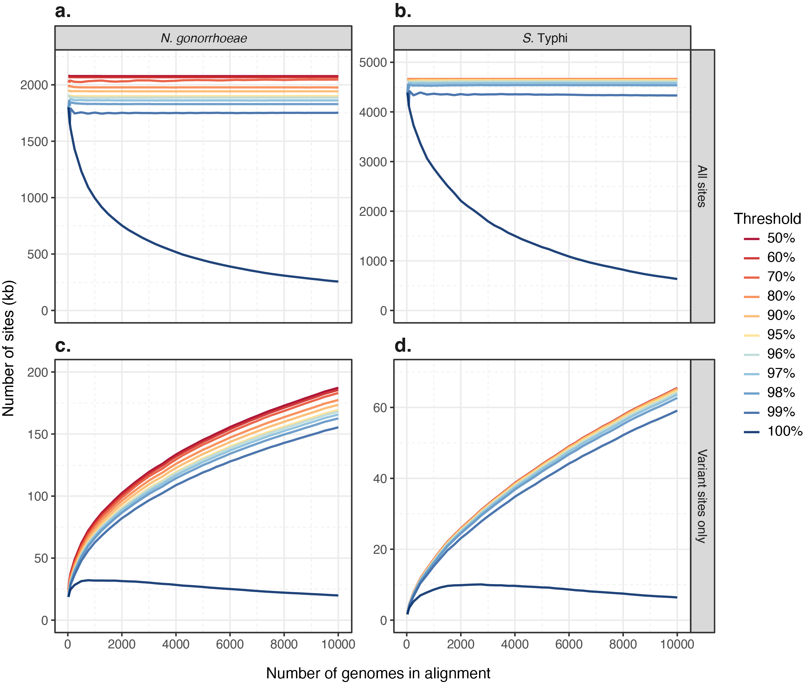
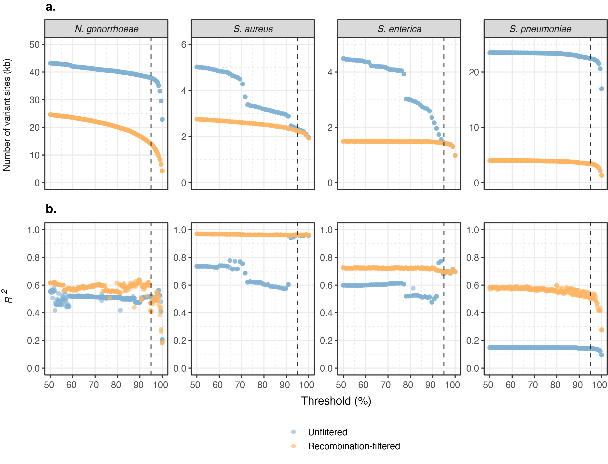
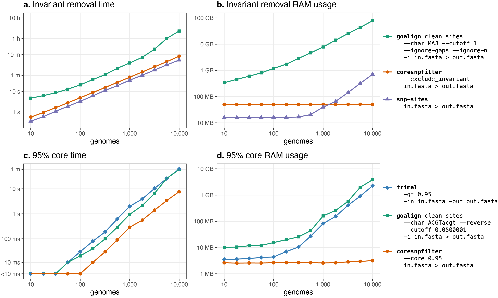

**Figure 1: Evaluation of Core-SNP-filter Thresholds on Alignment Size
and Variant Sites.** The number of alignment sites (in kilobases) is
plotted against the number of genomes included in each alignment
(ranging from 25 to 10,000). Each alignment was processed at core
thresholds ranging from 50% to 100% (indicated by line colour). (**a**)
All sites in *N. gonorrhoeae* alignments, (**b**) all sites in *S.*
Typhi alignments, (**c**) variant sites only in *N. gonorrhoeae*
alignments, and (**d**) variant sites only in *S.* Typhi alignments. The
number of sites was similar across different core thresholds, except for
the 100% threshold, which resulted in far fewer sites, particularly at
higher genome counts.

    

**Figure 2: Impact of Core-SNP Thresholds on Phylogenetic and Temporal
Signal Across Bacterial Datasets.** (**a**) The number of variant sites
(in kilobases) at each core genome threshold from 50% to 100% for four
bacterial datasets: *N. gonorrhoeae*, *S. aureus*, *S.* Kentucky, and
*S. pneumoniae*. The variant sites are shown for both
recombination-filtered (using Gubbins) and unfiltered alignments.
(**b**) The *R²* value from root-to-tip regression at each core
threshold from 50% to 100% for phylogenetic trees constructed from the
same four bacterial datasets, indicating the strength of the temporal
signal. For all plots, the dotted line represents the 95% core
threshold. Each dataset shows a steep decline in variant sites as the
threshold approaches 100%, with *N. gonorrhoeae* and *S. pneumoniae*
also exhibiting a reduction in *R²* as the threshold approaches 100%.

    

**Figure 3: Benchmarking of Core-SNP-filter Against Other Tools with
Similar Functionality.** The time taken (**a**) and RAM usage (**b**) to
remove invariant sites from alignments with varying numbers of genomes
using three different tools (*Goalign*, *Core-SNP-filter* and
*SNP-sites*).The time taken (**c**) and RAM usage (**d**) to generate a
95% core alignment across alignments with varying numbers of genomes
using three different tools (*TrimAl*, *Core-SNP-filter* and *Goalign*).
All axes are transformed with a log scale.
