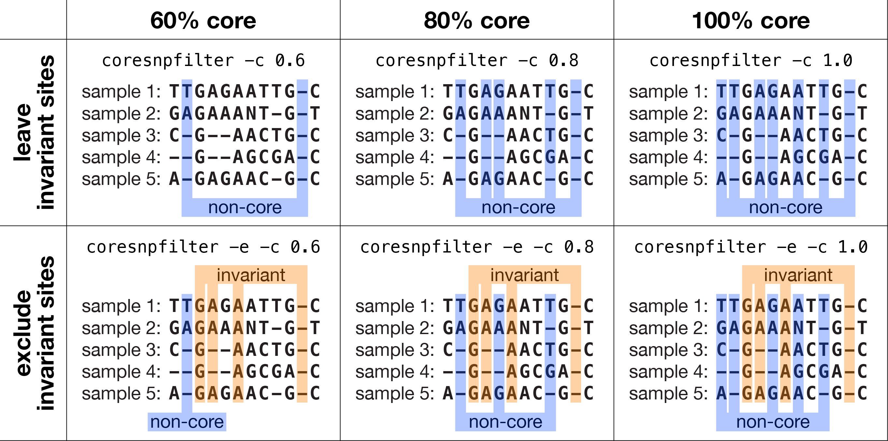
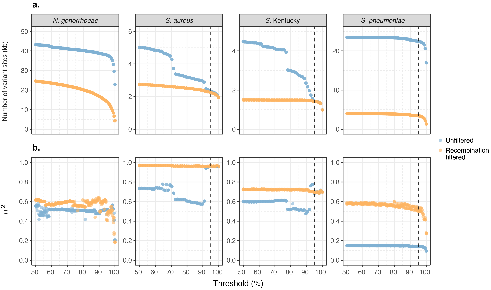
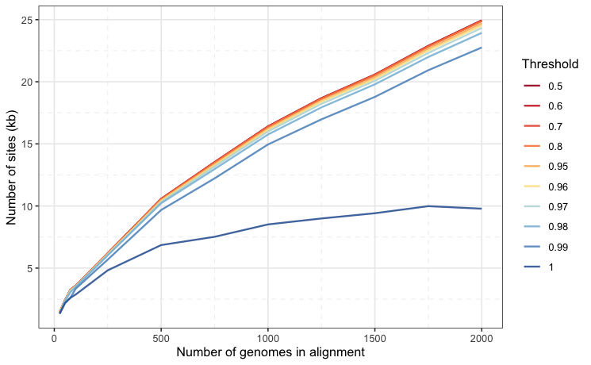
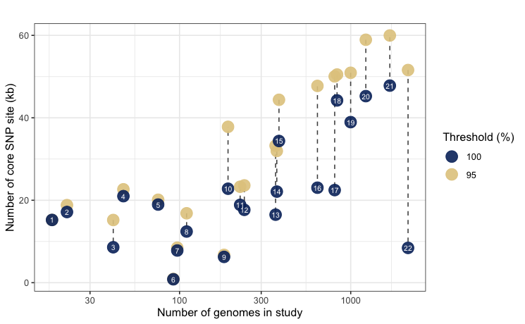
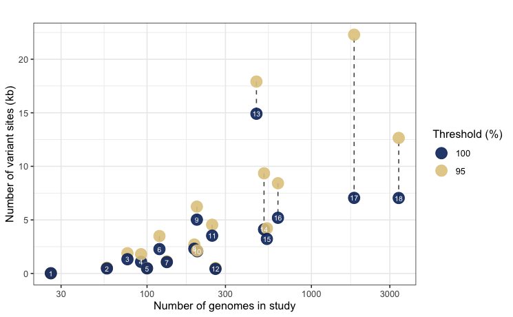
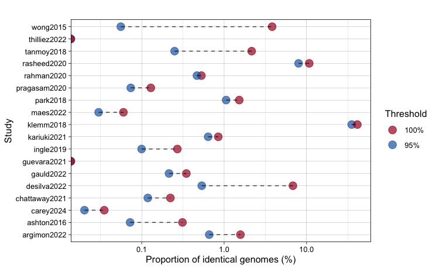
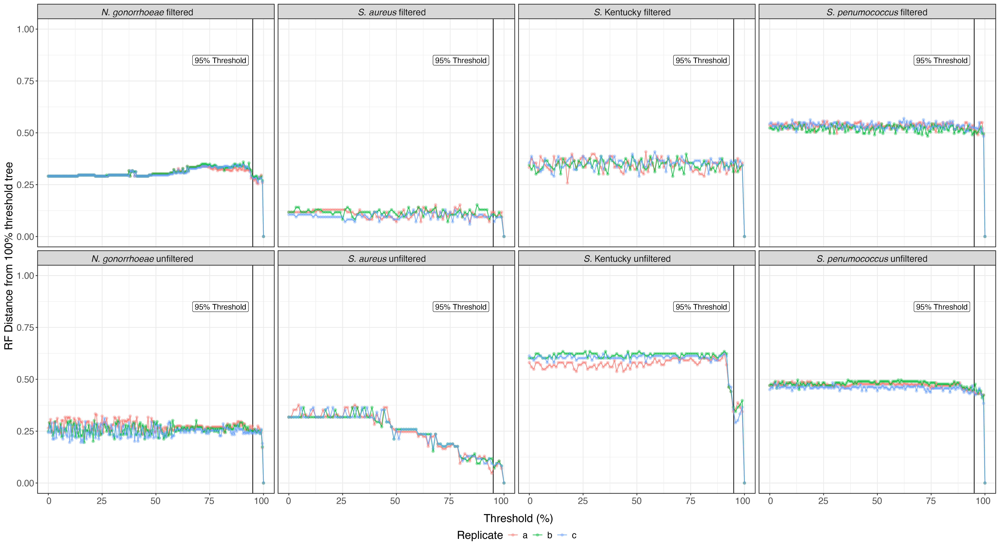

**Figure 1: Schematic of the core filtering process at various thresholds.** A visual depiction of how Core-SNP-filter processes sites with different settings. The highlighted sites are the ones that Core-SNP-filter will remove, i.e. the output will consist only of the non-highlighted sites. Core-SNP-filter uses `≥` for core site assessment, e.g. with `-c 0.8`, a site with 4/5 unambiguous bases is considered core. All non-`A`/`C`/`G`/`T` characters (e.g. `N` and `-`) are treated equally. A site can be both invariant and non-core, and when both `-e` and `-c` are used, invariant sites are filtered first, so some non-core sites may shift to the invariant category.

    

**Figure 2: Evaluation of core thresholds on alignment size and variant sites.** The number of alignment sites (in kilobases) is plotted against the number of genomes included in each alignment (ranging from 25 to 10,000). Each alignment was processed at core thresholds ranging from 50% to 100% (indicated by line colour). (**a**) All sites in _Neisseria gonorrhoeae_ alignments, (**b**) all sites in _Salmonella enterica_ subspecies Typhi alignments, (**c**) variant sites only in _Neisseria gonorrhoeae_ alignments, and (**d**) variant sites only in _Salmonella enterica_ subspecies Typhi alignments. The number of sites was similar across different core thresholds, except for the 100% threshold, which resulted in far fewer sites, particularly at higher genome counts.

    

**Figure 3: Impact of core thresholds on phylogenetic and temporal signal across bacterial datasets.** (**a**) The number of variant sites (in kilobases) at each core genome threshold from 50% to 100% for four bacterial datasets: _Neisseria gonorrhoeae_, _Staphylococcus aureus_, _Salmonella enterica_ subspecies Kentucky, and _Streptococcus pneumoniae_. The variant sites are shown for both recombination-filtered (using Gubbins) and unfiltered alignments. (**b**) The _R_² value from root-to-tip regression at each core threshold from 50% to 100% for phylogenetic trees constructed from the same four bacterial datasets, indicating the strength of the temporal signal. For all plots, the dotted line represents the 95% core threshold. Each dataset shows a steep decline in variant sites as the threshold approaches 100%, with _Neisseria gonorrhoeae_ and _Streptococcus pneumoniae_ also exhibiting a reduction in _R_² as the threshold approaches 100%.

    

**Figure 4: Benchmarking of Core-SNP-filter against other tools with similar functionality.** The time taken (**a**) and RAM usage (**b**) to remove invariant sites from alignments with varying numbers of genomes using three different tools (_Goalign_, _Core-SNP-filter_ and _SNP-sites_). The time taken (**c**) and RAM usage (**d**) to generate a 95% core alignment across alignments with varying numbers of genomes using three different tools (_TrimAl_, _Goalign_ and _Core-SNP-filter_). All axes are transformed with a log scale.

    

**Figure S1:** The number of alignment sites (in kilobases) is plotted against the number of genomes included in each alignment (ranging from 25 to 10,000). Each alignment was processed at core thresholds ranging from 50% to 100% (indicated by line colour). All sites in N. gonorrhoeae alignments, all sites in _S._ Typhi alignments, variant sites only in N. gonorrhoeae alignments, and variant sites only in _S._ Typhi alignments. The mean of ten alignments consisting of randomly aggregated genomes is plotted as the solid line and the minimum to maximum range for each threshold is plotted in the shaded area around each line. 

    

**Figure S2:** The number of variant sites in _S._ Typhi alignments with various numbers of genomes. Following removal of invariant and recombinogenic regions, each alignment was processed at core thresholds ranging from 50% to 100% (indicated by line colour) and the number of variant sites plotted. _S._ Typhi was chosen as recombination detection works best on closely related genomes, and for computational efficiency, only one set of alignments was only tested up until the 2000-genome alignment.

    

**Figure S3:** The number of variant sites (in kilobases) for each _N. gonorrhoeae_ dataset tested at both a 100% and 95% core-threshold alignment. The labels refer to datasets as follows: 1. Ezewudo et al. 2015, 2. Wind et al. 2017, 3. Ryan et al. 2018, 4. Kwong et al. 2016, 5. Kwong et al. 2018 6. Buckley et al. 2018, 7. Fifer et al. 2018, 8. Cehovin et al. 2018, 9. Didelot et al. 2016, 10. Golparian et al. 2020, 11. Lan et al. 2020, 12. Yahara et al. 2018, 13. Demczuk et al. 2015, 14. Lee et al. 2018, 15. Sanchez-Buso et al. 2019, 16. Thomas et al. 2019, 17. Alfsnes et al. 2020, 18. Mortimer et al. 2020, 19. Grad et al. 2016, 20. Town et al. 2020, 21. DeSilva et al. 2016, 22. Williamson et al. 2019.

    

**Figure S4:** The number of variant sites (in kilobases) for each _S._ Typhi dataset tested at both a 100% and 95% core-threshold alignment. The labels refer to datasets as follows: 1. Rasheed et al. 2020, 2. Thilliez et al. 2022, 3. Guevara et al. 2021, 4. Argimon et al. 2022, 5. Klemm et al. 2018, 6. Ingle et al. 2019, 7. Karuiki et al. 2021, 8. Pragasam et al. 2020, 9. Maes et al. 2022, 10. Rahman et al. 2020, 11. Park et al. 2018, 12. Gauld et al. 2022, 13. Carey et al. 2024, 14. Ashton et al. 2016, 15. Tanmoy et al. 2018, 16. Chattaway et. al 2021, 17. Wong et al. 2015, 18. Da Silva et al. 2022.

    

**Figure S5:** The plot shows the proportion of genome pairs with a pairwise SNP distance of zero for each _N. gonorrhoeae_ dataset, calculated as a percentage of all possible genome pairs. Proportions are displayed for alignments processed at two core-SNP thresholds: 100% and 95%. Dashed lines connect the values for the two thresholds within the same dataset, illustrating differences between the thresholds. The x-axis is presented on a logarithmic scale to highlight variations across datasets with differing proportions.

    

**Figure S6:** The plot shows the proportion of genome pairs with a pairwise SNP distance of zero for each _S._ Typhi dataset, calculated as a percentage of all possible genome pairs. Proportions are displayed for alignments processed at two core-SNP thresholds: 100% and 95%. Dashed lines connect the values for the two thresholds within the same dataset, illustrating differences between the thresholds. The x-axis is presented on a logarithmic scale to highlight variations across datasets with differing proportions.

    

**Figure S7:** Midpoint rooted phylogenetic trees for the four datasets used in the temporal analysis of this study. For each dataset a phylogenetic tree resulting from both the 100% and 95% core-threshold alignments is presented. Phylogenetic trees were generated allowing for polytomies, and these branches are coloured in red for all trees. The number of polytomies in each phylogeny can be found in Supplementary Table 3.

    

**Figure S8:** Robinson-Foulds (RF) distances compare the topologies of phylogenies generated using a 100% strict core threshold to those generated at varying thresholds (0–99%) across three replicates per dataset. RF distances are normalized: a value of one indicates maximally dissimilar trees, while zero indicates identical topologies. "Filtered" phylogenies were based on recombination-filtered alignments, while "unfiltered" phylogenies used unfiltered alignments. Across datasets, RF distances remain low as the core threshold decreases from 100%, suggesting that non-core information enhances the phylogenetic signal rather than distorting it.
